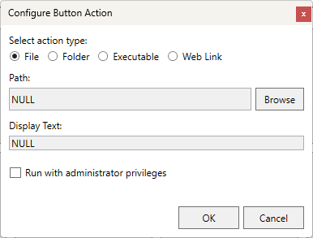

# Shortcut Keyboard

A programmable macro keyboard project featuring 8 customizable keys and a rotary encoder for volume control. Built with an RP2040 microcontroller and Cherry MX switches.

  
   
  <em>Shortcut Keyboard PCB</em>

## Features

- 8 programmable macro keys with Cherry MX switches (Blue or Brown)
- Rotary encoder with push button for volume control/mute
- USB-C connectivity
- RP2040 microcontroller
- CircuitPython firmware
- Windows compatibility
- Up to 3 different profiles for key configurations
- No additional drivers required

## Specifications

| Parameter | Value |
|-----------|-------|
| Input Voltage | 4.75-5.25V (USB) |
| Operating Current | ~50mA |
| Operating Temperature | 0-85°C |
| PCB Dimensions | 100 x 79 mm |
| Switches | Cherry MX Blue/Brown |
| Communication | USB HID |
| MCU | RP2040 |
| Firmware | CircuitPython |

## Hardware

The keyboard consists of three PCBs:
1. Main board with RP2040 and components
2. Top plate
3. Bottom plate

### Key Switch Options

| Feature | MX Blue | MX Brown |
|---------|---------|----------|
| Actuation Force | 60 cN | 55 cN |
| Pre-travel | 2.2 mm | 2.0 mm |
| Total Travel | 4.0 mm | 4.0 mm |
| Characteristics | Tactile & Clicky | Tactile |
| Sound | Audible click | Silent |

## Software

> ⚠️ **Note:** The C# configuration software is currently under development and will be released soon.

The software suite will include:
- Windows configuration application
- Three customizable profiles
- File/folder/application launch capabilities
- URL opening support
- System tray integration
- Dark mode support

  
  
   
  <em>Configuration Software Preview (Coming Soon)</em>

## Firmware

The keyboard runs CircuitPython firmware with the following features:
- USB HID implementation
- Key debouncing
- Rotary encoder support
- Volume control integration
- Multiple profile support

## Version Information

The project uses semantic versioning:
- Current Version: V1.1.1-beta
- Format: MAJOR.MINOR.PATCH-stage
- PCB Version Format: YYYY-NN-VX (e.g., 2024-01-V1)

## License

This project is licensed under the BSD 2-Clause License - see the LICENSE file for details.
